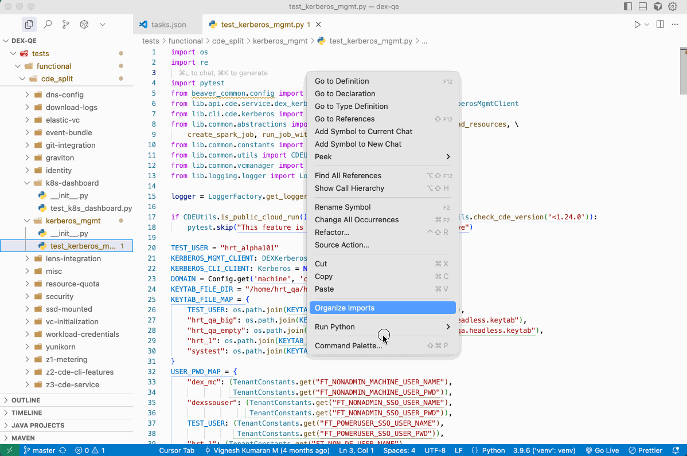

# Kubectl_Tools
External Tool to use in your IDE (say **Cursor** or **Pycharm**) to Copy Current Test File/Folder to Kubernetes container.
Also, you can run:
* Run **Tests directl**y on container from IDE using `pytest` command.
* Run `system-test` using `/ansible/system_test.yaml` file
* Run any **ansible-playbook** on container (E.g. `ansible-playbook sample-setup.yaml`)

## How to set up Kubectl Tools in Cursor IDE
### Setting up the Tasks:
1. Open the Command Palette in Cursor with `Cmd + Shift + P` (macOS) or `Ctrl + Shift + P` (Windows/Linux).
2. Search for and select **"Tasks: Configure Task"**.
3. Choose **"Create tasks.json file from template"**.
4. Select **"Others"** to create a custom task.

This will generate a `tasks.json` file in your project's `.vscode` directory.
Now, you need to add a task definition for your `kubectl_tools` script.
Replace the content of the file with the following:
(Change the `<< Full-Path-To-Kubectl_Tools-Project >>` accordingly:

```json
{
    "version": "2.0.0",
    "tasks": [
      {
        "label": "Kubectl Copy & Run",
        "type": "process",
        "command": "<< Full-Path-To-Kubectl_Tools-Project >>/Kubectl_Tools/kube_tools.py",
        "args": [
          "${file}",
          "${workspaceFolderBasename}"
        ],
        "group": "test",
        "presentation": {
          "reveal": "always",
          "panel": "new"
        },
        "problemMatcher": []
      }
    ]
  }
```
* You can create 3 entries by modifying `"command"` filed in json:
  * For **Kubectl Copy & Run** enter `kube_tools.py`
  * For **Kubectl Copy Only** enter `kube_tools_copy.py`
  * For **Kubectl Run Only** enter `kube_tools_run_test.py`

Or you can **copy-paste** the json content from [**tasks.json**](vscode_support/tasks.json) file.

### How to Run KubeTools from Cursor IDE
1. **Open the Command Palette**: Press `Ctrl + Shift + P` (or `Cmd + Shift + P` on macOS).
2. **Type "Run Task"**: Start typing `run task` in the search bar. This will filter the list of available commands.
3. **Select a Task**: You will see a list of available tasks, which includes the three tasks you defined in your `tasks.json` file:
   * `Kubectl Copy & Run`
   * `Kubectl Copy Only`
   * `Kubectl Run Only`
4. **Press Enter**: Select the task you want to run and press `Enter`.



### _Optionally_: Creating a Keybinding
To make this solution easy to use, just like in PyCharm, you can create a custom keybinding to run the task with a single shortcut.
1. Open the Command Palette again with `Cmd + Shift + P` or `Ctrl + Shift + P`.
2. Search for and select **"Preferences: Open Keyboard Shortcuts (JSON)"**.
3. Add the following JSON object to the array in the `keybindings.json` file.
```json
[
  {
    "key": "cmd+shift+k",
    "command": "workbench.action.tasks.runTask",
    "args": "Kubectl Copy & Run"
  }
]

```
Or you can **copy-paste** the json content from [**keybindings.json**](vscode_support/keybindings.json) file.

## AI Agent (Coming Soon) 👷🏻‍♂️
AI Agent to run your tests on test container directly from cursor IDE.

## How to set up Kubectl Tools in PyCharm IDE
Refer Pycharm [Create/Edit/Copy Tool Dialog!](https://www.jetbrains.com/help/pycharm/settings-tools-create-edit-copy-tool-dialog.html)

### Steps to Create External Tools:
* Clone this Repository in your local machine.
* In Pycharm IDE, Go to Preferences (`⌘`+`,`)
* Go to `External Tools` under **Tools** Section
* Click on `+` icon to create a new Tool
* In `Name` field give any name (Say **Kubectl CP**)
* In `Program` field select full path of the `kube_tool*.py` python file as below:
  * For **Kubectl Copy & Run** select `kube_tools.py`
  * For **Kubectl Copy Only** select `kube_tools_copy.py`
  * For **Kubectl Run Only** select `kube_tools_run_test.py`
* In `Arguments` field enter Two Arguments `$FilePath$` and `$ModuleName$`
* In `Working Directory` field enter `$ProjectFileDir$` or **Kubectl_Tools** Project Dir (Optional)
* Click OK and Apply then you are ready to go!


### How to Run KubeTools from PyCharm IDE
* Select the file or folder you want to copy or run tests on container.
* Right Click, Go to `External Tools` and Select your `Kubectl Tool`
* That's all! Keep an eye on the Console/Run Tab :)

## Notes:
* `ktoolrc.ini` file will be auto-generated when you run the script for the first time.
* When you are running the tool for the first time or when you want to change the Pod Name,
Go to `ktoolrc.ini` file at `$ProjectFileDir$` and add/change the value for `podname` field.
* This is one time task per Pod Name change.
* Delete the `ktoolrc.ini` file from your `$ProjectFileDir$`,
if you make any code changes in this repository as all the constants
are picked up by the `ini` file.
* Add `ktoolrc.ini` to your projects `.gitignore` file if required.
* Currently, this tool supports requires Python3+ (As Python2.7 is deprecated)

## Errors:
* `Cannot Run Program /path/kube_tools.py; [error=2] No such file or directory`
  - The files are basically Python scripts. i.e., we use `#!/usr/bin/python3` in the beginning of these script files.
  - Make sure you have **Python3** set to `/usr/bin/python3`.
  - Else Replace the line `#!/usr/bin/python3` in `kube_tools*.py` files, with whichever location you have **Python3** configured.
    - For Eg: `/user/local/bin/python3`

* Unable to run kubectl commands?
  - Before using this tool, make sure you have kubectl package installed in your system.
  - Make sure basic kubectl commands are working on your namespace.